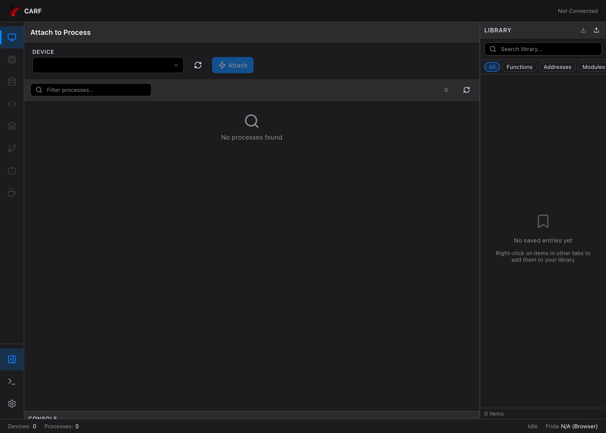

# CARF

**Cross-platform Application Runtime Framework**

> 🔬 Frida 기반 동적 분석 GUI 도구

<p align="center">
  
</p>

## 개요

CARF는 [Frida](https://frida.re/)를 기반으로 한 크로스 플랫폼 동적 분석 도구입니다. 모던 IDE 스타일의 인터페이스를 통해 리버스 엔지니어링과 보안 연구를 위한 강력한 기능을 제공합니다.

### 주요 기능

- 🖥️ **프로세스 관리**: 디바이스 열거, 프로세스 attach/spawn/kill
- 🔍 **메모리 분석**: 메모리 읽기/쓰기, 값 스캔, 메모리 워치
- 📦 **모듈 탐색**: 로드된 모듈, Export/Import 심볼 탐색
- 🎯 **후킹**: Native/ObjC/Java 메소드 후킹
- 📚 **라이브러리**: 주소, 함수, 클래스 등 저장 및 관리
- ⌨️ **키보드 단축키**: Command Palette (Cmd+K), 빠른 탐색
- 🎨 **테마**: 다크/라이트 모드 지원

## 설치

### 요구사항

- [Bun](https://bun.sh/) >= 1.0
- [Rust](https://rustup.rs/) >= 1.70
- [Frida](https://frida.re/) >= 17.0

### 빌드

```bash
# 의존성 설치
bun install

# 개발 서버 실행 (브라우저 전용)
bun run dev

# Tauri 앱 개발 모드
bun run tauri dev

# 프로덕션 빌드
bun run tauri build
```

## 아키텍처

```
┌─────────────────────────────────────────────────────────────────┐
│                        React Frontend                           │
│  ┌─────────────────┐  ┌─────────────────┐  ┌─────────────────┐ │
│  │   Zustand Store │  │   Components    │  │     Pages       │ │
│  └────────┬────────┘  └────────┬────────┘  └────────┬────────┘ │
└───────────┼────────────────────┼────────────────────┼──────────┘
            │                    │                    │
            ▼                    ▼                    ▼
┌─────────────────────────────────────────────────────────────────┐
│                    Tauri Backend (Rust)                         │
│  ┌─────────────────────────────────────────────────────────────┐│
│  │ FridaService: Device, Session, Script management            ││
│  └─────────────────────────────────────────────────────────────┘│
└───────────┬─────────────────────────────────────────────────────┘
            │
            ▼
┌─────────────────────────────────────────────────────────────────┐
│                    Frida Agent (TypeScript)                     │
│  ┌─────────────────────────────────────────────────────────────┐│
│  │ RPC Methods: Native, Memory, ObjC, Java, Thread            ││
│  └─────────────────────────────────────────────────────────────┘│
└─────────────────────────────────────────────────────────────────┘
```

## 프로젝트 구조

```
carf/
├── src/                    # React 프론트엔드
│   ├── components/         # UI 컴포넌트
│   │   ├── layout/        # 레이아웃 컴포넌트
│   │   ├── panels/        # 패널 컴포넌트
│   │   └── ui/            # 공통 UI 컴포넌트
│   ├── contexts/          # React Context
│   ├── features/          # 기능별 모듈
│   │   └── frida/         # Frida 통합
│   ├── hooks/             # Custom Hooks
│   ├── pages/             # 페이지 컴포넌트
│   ├── stores/            # Zustand 스토어
│   └── styles/            # 테마 & 스타일
├── src-frida/             # Frida Agent (TypeScript)
│   ├── methods/           # RPC 메소드 구현
│   └── rpc/               # RPC 라우터
├── src-tauri/             # Tauri 백엔드 (Rust)
│   └── src/
│       ├── commands/      # Tauri 커맨드
│       └── services/      # 서비스 레이어
└── docs/                  # 문서
```

## 키보드 단축키

| 단축키 | 동작 |
|--------|------|
| `Cmd+K` / `Ctrl+K` | Command Palette 열기 |
| `Cmd+,` / `Ctrl+,` | Settings 열기 |
| `Cmd+Shift+L` | Library 패널 토글 |
| `Cmd+`` ` | Console 패널 토글 |
| `Cmd+1~9` | 탭 전환 |

## 개발

### 스크립트

```bash
# 개발 서버 (브라우저 전용)
bun run dev

# Tauri 개발 모드
bun run tauri dev

# Frida 에이전트 컴파일
bun run compile:tools

# 프로덕션 빌드
bun run build
bun run tauri build
```

### 브라우저 전용 모드

Tauri 없이 브라우저에서만 실행할 수 있습니다. Frida 기능은 비활성화되지만 UI 개발에 유용합니다.

```bash
bun run dev
# http://localhost:1420 에서 확인
```

## 문서

- [API 명세서](docs/API_SPECIFICATION.md) - Frida API 상세 문서
- [아키텍처](docs/ARCHITECTURE.md) - 시스템 아키텍처
- [개발 가이드](docs/DEVELOPMENT.md) - 개발 환경 설정

## 기술 스택

### Frontend
- **React 19** - UI 라이브러리
- **TypeScript** - 타입 안전성
- **Zustand** - 상태 관리
- **Emotion** - CSS-in-JS
- **Lucide** - 아이콘
- **react-resizable-panels** - 리사이즈 가능한 패널

### Backend
- **Tauri 2** - 데스크톱 앱 프레임워크
- **Rust** - 백엔드 언어
- **frida-rust** - Frida 바인딩

### Agent
- **TypeScript** - 에이전트 언어
- **frida-compile** - 에이전트 번들링

## 라이선스

MIT License

## 기여

이슈와 PR을 환영합니다!

1. Fork the repository
2. Create your feature branch (`git checkout -b feature/amazing-feature`)
3. Commit your changes (`git commit -m 'Add some amazing feature'`)
4. Push to the branch (`git push origin feature/amazing-feature`)
5. Open a Pull Request
